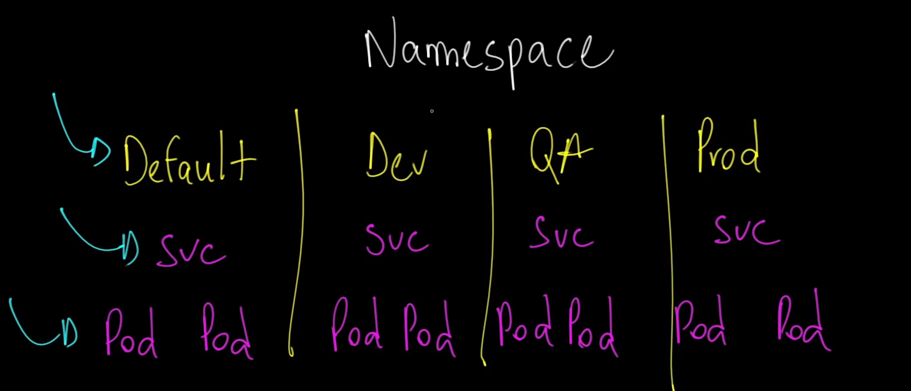

# Namespaces no Kubernetes

No Kubernetes, um namespace é uma forma de dividir recursos em um cluster de forma lógica. Imagine que você tem um grande terreno (seu cluster Kubernetes) e quer dividi-lo em várias áreas menores para diferentes propósitos (seus namespaces). Cada área pode ter suas próprias regras, recursos e acessos, permitindo que você organize e gerencie seus recursos de forma eficiente.

## Pontos Chave sobre Namespaces no Kubernetes

1. **Isolamento**: Cada namespace é isolado dos outros, então os recursos (como pods, serviços e volumes) em um namespace não interagem diretamente com recursos em outro namespace.

2. **Gerenciamento de Recursos**: Você pode aplicar limites de recursos e quotas a namespaces específicos para controlar a quantidade de CPU e memória que pode ser usada, ajudando a evitar que uma aplicação consuma todos os recursos do cluster.

3. **Facilidade de Gerenciamento**: Organizar recursos em namespaces facilita o gerenciamento, especialmente em ambientes com muitas aplicações ou equipes diferentes trabalhando no mesmo cluster.

4. **Separação de Ambientes**: Você pode usar namespaces para separar diferentes ambientes, como desenvolvimento, teste e produção, dentro do mesmo cluster.

## Exemplo Prático

Um exemplo prático seria ter um namespace chamado `dev` para recursos de desenvolvimento e outro chamado `prod` para recursos de produção. Isso ajuda a garantir que as aplicações em desenvolvimento não interfiram nas aplicações em produção. (geralmente as empresas tem um cluster voltado para o ambiente de desenvolvimento)

Namespaces são úteis para manter a organização e a segurança em clusters Kubernetes, especialmente à medida que eles crescem em tamanho e complexidade.

