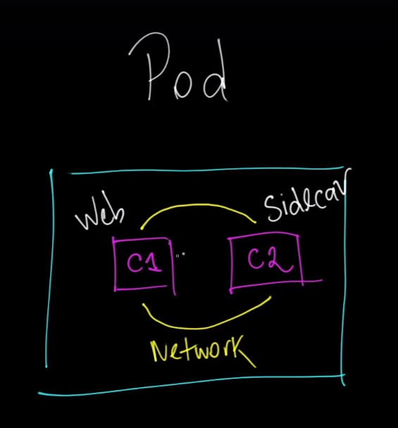

# Kubernetes Pod

Um **Pod** é a menor unidade de execução em um cluster Kubernetes. Aqui está uma explicação simples sobre o que é um Pod e como ele funciona:

## O que é um Pod?

- **Contêiner de Execução:** Um Pod pode conter um ou mais contêineres, que compartilham os mesmos recursos e contexto de execução. Normalmente, um Pod tem apenas um contêiner, mas em alguns casos específicos, pode ter múltiplos contêineres que precisam trabalhar juntos.

  
- **Ambiente Compartilhado:** Todos os contêineres dentro de um Pod compartilham o mesmo endereço IP, espaço de armazenamento (volumes) e namespace de rede. Isso significa que eles podem se comunicar entre si usando localhost.

