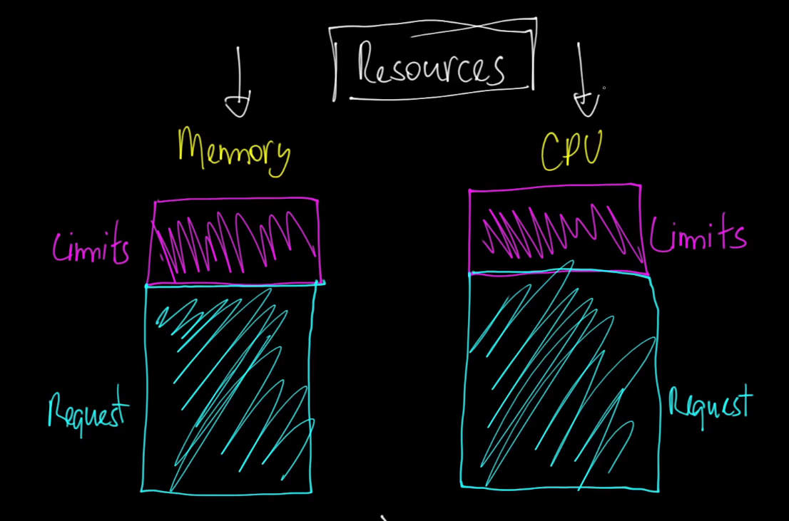

# Gerenciamento de Recursos no Kubernetes

# Gerenciamento de Recursos no Kubernetes

No Kubernetes, o termo "resources" refere-se aos recursos que o cluster Kubernetes gerencia e utiliza para executar as cargas de trabalho (workloads). Esses recursos incluem CPU, memória (RAM), armazenamento e, em alguns casos, recursos de rede. Aqui está uma visão geral dos principais conceitos relacionados a resources no Kubernetes:

## 1. Requests e Limits

- **Requests**: Especifica a quantidade mínima de recursos (CPU, memória) que um contêiner precisa para funcionar corretamente. O Kubernetes usa esses valores para decidir em qual nó alocar um Pod. Se um Pod solicitar mais recursos do que estão disponíveis em um nó, ele não será agendado para aquele nó.

- **Limits**: Define a quantidade máxima de recursos que um contêiner pode usar. Se um contêiner tenta usar mais recursos do que o limite, ele é restringido. Para memória, se um contêiner exceder o limite, ele pode ser encerrado (killed) pelo Kubernetes.

## 2. CPU e Memória

- **CPU**: No Kubernetes, a unidade de CPU é representada em milicores (m). Por exemplo, 1000m equivale a 1 núcleo de CPU. Um contêiner pode pedir uma fração de um núcleo de CPU (por exemplo, 250m para 25% de um núcleo).

- **Memória**: A memória é especificada em bytes, comumente usando unidades como MiB (Mebibytes) e GiB (Gibibytes). 

## 3. Resource Quotas

Em um ambiente multi-tenant, onde vários times ou aplicações compartilham o mesmo cluster Kubernetes, é importante garantir que nenhum grupo consuma mais recursos do que deveria. Para isso, você pode usar **Resource Quotas**.

- **ResourceQuota**: Um ResourceQuota é uma política aplicada em um namespace que limita a quantidade de recursos que podem ser consumidos por todos os Pods, PersistentVolumeClaims, etc., nesse namespace. Ele ajuda a garantir uma alocação justa de recursos entre diferentes equipes.

## 4. Horizontal Pod Autoscaler (HPA)

O HPA ajusta automaticamente o número de réplicas de um Pod com base na utilização dos recursos (como CPU e memória). Isso ajuda a escalar as aplicações de forma eficiente conforme a demanda de recursos varia.

## 5. Node e Pod Affinity/Anti-Affinity

Além dos resources diretos, Kubernetes permite configurar afinidades ou anti-afinidades de Pods e Nodes para garantir que certas workloads sejam distribuídas de maneira específica no cluster.

- **Node Affinity**: Define em quais nodes um Pod pode ser agendado.
- **Pod Affinity/Anti-Affinity**: Define se os Pods devem ser agendados juntos ou separados uns dos outros.

## Conclusão

O gerenciamento de recursos no Kubernetes é um aspecto crucial para garantir que as aplicações rodem de forma eficiente e que os recursos do cluster sejam utilizados de maneira justa e controlada. Com o uso de requests, limits, quotas, e escalonamento automático, o Kubernetes oferece uma plataforma robusta para a execução de aplicações em escala.
