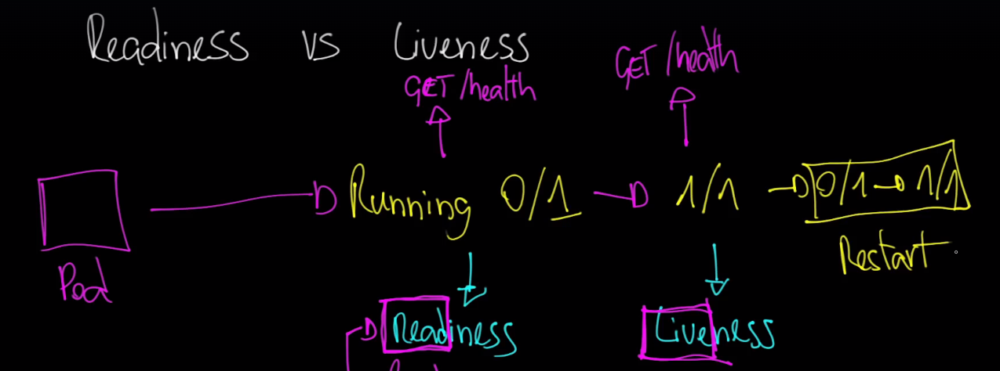

# Probes no Kubernetes

Os probes no Kubernetes são mecanismos de verificação de saúde utilizados para monitorar o estado dos containers em execução. Eles garantem que os containers estejam funcionando corretamente e, se necessário, tomam ações como reiniciar o container ou removê-lo temporariamente do serviço. Existem três tipos principais de probes: **liveness probe**, **readiness probe** e **startup probe**.

## Tipos de Probes

### 1. Liveness Probe
A **liveness probe** é usada para verificar se um container está "vivo" ou saudável. Se o container falhar nessa verificação, o Kubernetes reiniciará o container automaticamente. Esse tipo de probe é útil para detectar situações em que o container entrou em um estado irrecuperável, onde o reinício é a única solução.

### 2. Readiness Probe
A **readiness probe** verifica se um container está pronto para receber tráfego. Embora a liveness probe garanta que o container esteja vivo, a readiness probe garante que ele esteja pronto para aceitar conexões. Se a readiness probe falhar, o container será temporariamente removido do serviço de balanceamento de carga até que esteja pronto novamente.

### 3. Startup Probe
A **startup probe** é usada para verificar se um container conseguiu iniciar corretamente. Esse tipo de probe é especialmente útil para containers que possuem um tempo de inicialização mais longo, evitando que liveness probes normais falhem antes que o container esteja completamente pronto. A startup probe informa ao Kubernetes que o container ainda está em processo de inicialização e não deve ser reiniciado prematuramente.

## Métodos de Verificação

Os probes no Kubernetes podem ser configurados com base em diferentes métodos de verificação, como:

- **HTTP GET**: Realiza uma requisição HTTP a um endpoint específico.
- **TCP Socket**: Verifica se uma porta TCP está aberta.
- **Exec Command**: Executa um comando dentro do container e verifica o código de saída.

## Importância dos Probes

Os probes são cruciais para a automação da gestão da saúde dos containers no Kubernetes. Eles ajudam a garantir que as aplicações continuem funcionando corretamente, mesmo em caso de falhas ou lentidões temporárias. Isso permite que o Kubernetes mantenha o estado desejado das aplicações, reiniciando ou removendo containers problemáticos conforme necessário, contribuindo para a alta disponibilidade e resiliência das aplicações no cluster.

