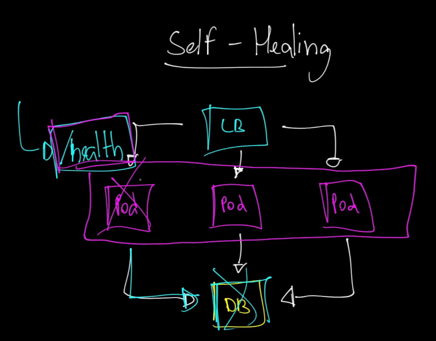
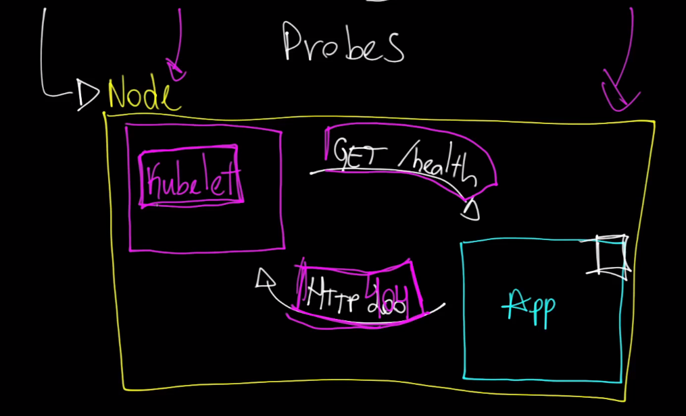

# Probes no Kubernetes

Os probes no Kubernetes são mecanismos de verificação de saúde utilizados para monitorar o estado dos containers em execução. Eles garantem que os containers estejam funcionando corretamente e, se necessário, tomam ações como reiniciar o container ou removê-lo temporariamente do serviço. Existem três tipos principais de probes: **liveness probe**, **readiness probe** e **startup probe**.

