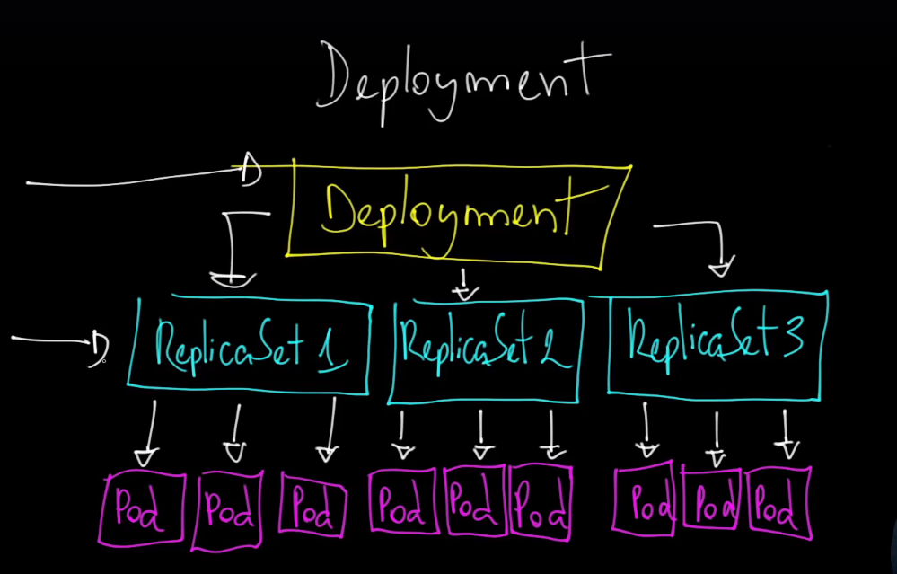

# Kubernetes Deployments

## O que é um Deployment?

Um *Deployment* no Kubernetes é um recurso que fornece uma maneira declarativa de gerenciar e escalar aplicativos contêinerizados. Com um Deployment, você pode definir como deseja que seu aplicativo seja implementado no cluster, como a quantidade de réplicas, a estratégia de atualização e o contêiner a ser usado.

## Estrutura de um Deployment

Um *Deployment* especifica uma `Pod template`, que é usada para criar os Pods. O *Pod template* define o contêiner a ser executado, a imagem do contêiner, variáveis de ambiente, volumes, portas expostas, etc. O Deployment também define o número de réplicas, ou seja, quantos Pods devem estar rodando ao mesmo tempo.

## Gerenciamento de Réplicas

O *Deployment* usa um *ReplicaSet* para garantir que o número desejado de réplicas do aplicativo esteja em execução. Se um Pod falhar, o *ReplicaSet* cria um novo Pod para substituí-lo, mantendo a disponibilidade do serviço.

## Atualizações e Rollbacks

O *Deployment* facilita as atualizações de aplicativos com suporte para atualizações progressivas (*rolling updates*), onde os Pods antigos são substituídos gradualmente pelos novos. Se algo der errado durante uma atualização, você pode reverter facilmente para a versão anterior com um *rollback*.

## Estratégias de Atualização

Existem duas estratégias principais de atualização:

- **RollingUpdate:** Substitui gradualmente os Pods antigos pelos novos.
- **Recreate:** Remove todos os Pods antigos antes de criar os novos.

## Escalabilidade 

Você pode facilmente escalar um Deployment ajustando o número de réplicas, seja manualmente ou automaticamente com o Horizontal Pod Autoscaler (HPA).

## Monitoramento e Gestão de Estado

O Kubernetes monitora constantemente os Deployments para garantir que o estado desejado seja mantido, recriando Pods se necessário para alcançar o estado especificado.

### deploy e gerenciamento de aplicações no cluster

- **Deployment:** Geralmente utilizado para aplicações stateless, mas pode gerenciar aplicações stateful em algumas situações.
- **StatefulSet:** Utilizado para gerenciar aplicações stateful que necessitam de identidades persistentes e armazenamento persistente.
- **DaemonSet:** Usado para garantir que um Pod específico rode em cada Node do cluster, frequentemente para tarefas como coleta de logs, monitoramento, e gerenciamento de sistema.