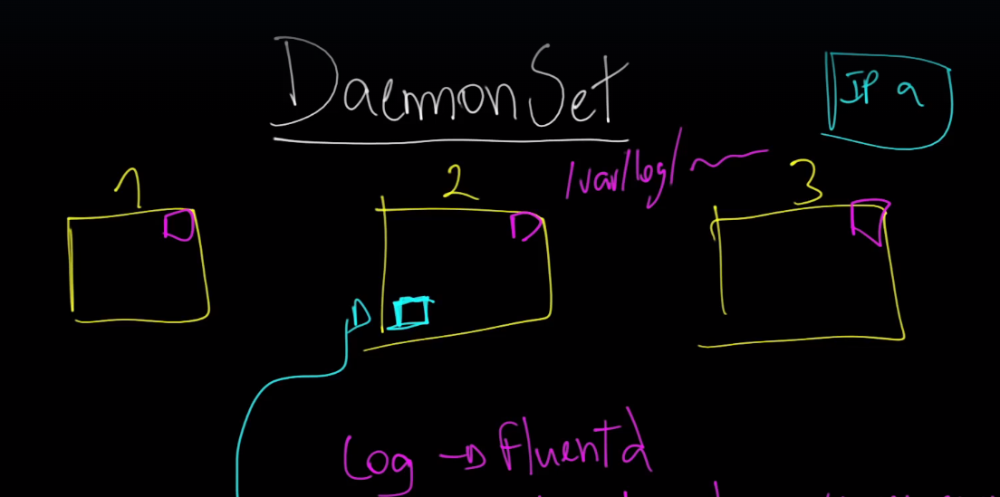

# DaemonSets no Kubernetes

Um **DaemonSet** é um objeto no Kubernetes que garante que uma cópia de um pod específico esteja rodando em cada nó do cluster. Isso é particularmente útil para tarefas que precisam ser executadas em todos os nós, como monitoramento, coleta de logs ou execução de agentes de rede.

## Funcionamento Básico

- Quando um DaemonSet é criado, o Kubernetes garante que um pod correspondente seja agendado em todos os nós disponíveis.
- Se um novo nó for adicionado ao cluster, o DaemonSet automaticamente agendará um pod nesse nó.
- Se um nó for removido, os pods do DaemonSet naquele nó são excluídos automaticamente.

