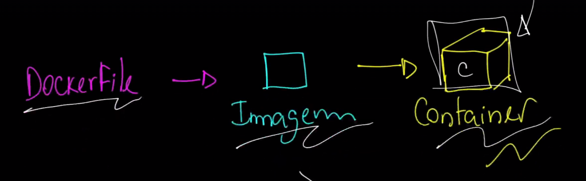
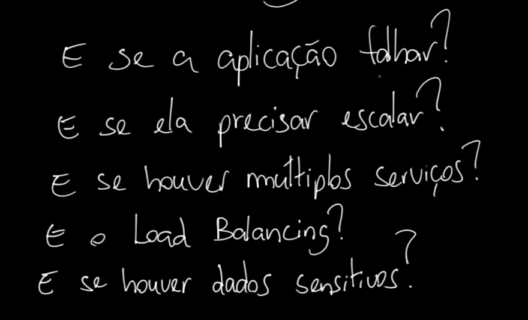
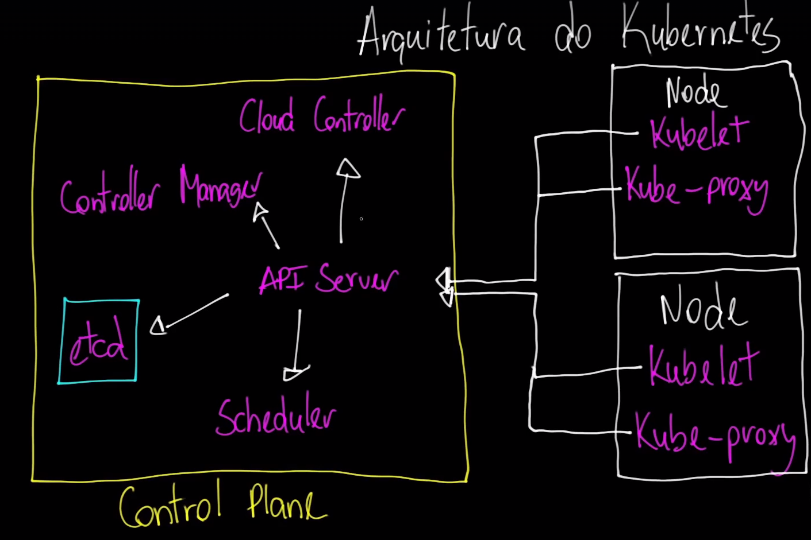

# Criando e Gerenciando Containers

## Processo de Criação de um Container

O processo para criar um container envolve três etapas principais:

1. **Dockerfile:** Um arquivo de texto que contém todas as instruções para construir a imagem do container.
2. **Imagem:** O resultado do Dockerfile, que é uma blueprint para o container.
3. **Container:** A instância em execução da imagem.

## Considerações para Produção

Quando pensamos em um ambiente de produção, é essencial levar em conta algumas perguntas críticas:

- **E se a aplicação falhar?**
  - Como lidar com falhas e reiniciar automaticamente?
  
- **E se ela precisar escalar?**
  - Quais estratégias de escalabilidade utilizar?
  
- **E se houver múltiplos serviços?**
  - Como orquestrar vários containers e serviços?
  
- **E o Load Balancing?**
  - Como distribuir o tráfego de forma eficiente?
  
- **E se houver dados sensíveis?**
  - Como garantir a segurança e conformidade dos dados?

# Arquitetura do Kubernetes

https://kubernetes.io/docs/home/

## Control Plane

O Control Plane gerencia o cluster do Kubernetes. Ele é composto por vários componentes principais:

- **API Server:** Expoem a API do Kubernetes. Quando interagimos com o cluster, estamos utilizando o API Server. Tudo passa por ele.
- **etcd:** Banco de dados chave/valor, considerado o componente mais crítico do cluster, pois é a base de dados do Kubernetes.
- **Scheduler:** Responsável por encontrar os Nodes apropriados para alocar os pods.
- **Controller Manager:** Uma aplicação que lê as regras descritas e garante que o estado atual do cluster corresponda ao estado desejado.
- **Cloud Controller Manager:** Interage com os provedores de cloud para gerenciar recursos como balanceadores de carga, volumes de armazenamento e nós no ambiente de cloud.

## Data Plane

O Data Plane executa as aplicações e é composto por vários Nodes, onde cada Node contém os seguintes componentes:

- **Kubelet:** O agente que roda em cada Node do cluster. Ele garante que os containers estão rodando em um pod.
- **Kube-proxy:** Mantém as regras de rede aplicáveis a cada Node.

## kubectl

**kubectl** é uma ferramenta de linha de comando utilizada para interagir com um cluster Kubernetes.

- **Interação com o API Server:** O kubectl se comunica diretamente com o API Server do cluster. Isso permite que você realize diversas operações no cluster, como criar, inspecionar, atualizar e excluir recursos do Kubernetes.
- **Contexts:** Através dos contexts, é possível configurar e alternar entre múltiplos clusters Kubernetes. Isso facilita a administração de diferentes ambientes (por exemplo, desenvolvimento, teste e produção) a partir de um único conjunto de comandos kubectl.

